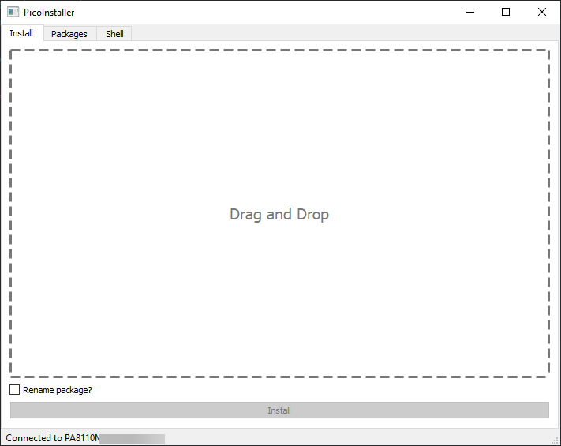

# picoInstaller
Simple ADB installer, which can install APK or ZIP files with OBB cache

# Install

To install this app you need Python >3.6 and install some requirements:
1. `pip install -r requirements.txt`
2. Run picoInstaller/view.py

# How it looks

